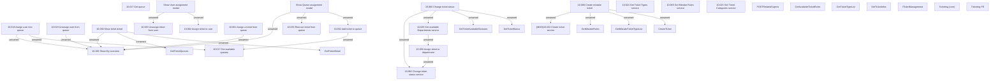

# Ticketing - involved use cases

```mermaid
graph TD
    n_10_017_Get_queue["10.017 Get queue"]
    n_10_018_Assign_user_into_queue["10.018 Assign user into queue"]
    n_10_019_Unassign_user_from_queue["10.019 Unassign user from queue"]
    n_10_100_Show_My_overview["10.100 Show My overview"]
    Show_Queue_assignment_modal["Show Queue assignment modal"]
    Show_User_assignment_modal["Show User assignment modal"]
    n_10_030_Show_ticket_detail["10.030 Show ticket detail"]
    n_10_050_Assign_ticket_to_department["10.050 Assign ticket to department"]
    n_10_063_Unassign_ticket_from_user["10.063 Unassign ticket from user"]
    n_10_062_Assign_ticket_to_user["10.062 Assign ticket to user"]
    n_10_061_Assign_a_ticket_from_queue["10.061 Assign a ticket from queue"]
    n_10_033_Remove_ticket_from_queue["10.033 Remove ticket from queue"]
    n_10_032_Add_ticket_to_queue["10.032 Add ticket to queue"]
    n_10_017_Get_available_queues["10.017 Get available queues"]
    n_10_060_Change_ticket_status["10.060 Change ticket status"]
    n_10_062_Change_ticket_status_service["10.062 Change ticket status service"]
    n_10_080_Create_mistake_ticket["10.080 Create mistake ticket"]
    n_10_024_Get_Ticket_Types_service["10.024 Get Ticket Types service"]
    n_10_085_Get_Mistake_Rules_service["10.085 Get Mistake Rules service"]
    n_10_023_Get_Ticket_Categories_service["10.023 Get Ticket Categories service"]
    n_10_025_Get_available_Departments_service["10.025 Get available Departments service"]
    GetTicketQueues["GetTicketQueues"]
    POSTRelatedSujects["POSTRelatedSujects"]
    GetMistakeRules["GetMistakeRules"]
    GetAvailableTicketRoles["GetAvailableTicketRoles"]
    GetTicketTypeList["GetTicketTypeList"]
    GetTicketAvailableStatuses["GetTicketAvailableStatuses"]
    SetTicketStatus["SetTicketStatus"]
    GetMistakeTicketTypeList["GetMistakeTicketTypeList"]
    CreateTicket["CreateTicket"]
    GetTicketDetail["GetTicketDetail"]
    GetTicketInfos["GetTicketInfos"]
    ITicketManagement["ITicketManagement"]
    MOD_10_022_Create_ticket_service["{MOD}10.022 Create ticket service"]
    Ticketing_core["Ticketing (core)"]
    Ticketing_FE["Ticketing FE"]
    n_10_060_Change_ticket_status -->|unnamed| n_10_062_Change_ticket_status_service
    Show_Queue_assignment_modal -->|unnamed| n_10_100_Show_My_overview
    n_10_019_Unassign_user_from_queue -->|unnamed| n_10_100_Show_My_overview
    n_10_061_Assign_a_ticket_from_queue -->|unnamed| n_10_100_Show_My_overview
    n_10_018_Assign_user_into_queue -->|unnamed| n_10_100_Show_My_overview
    n_10_025_Get_available_Departments_service -->|unnamed| n_10_050_Assign_ticket_to_department
    Show_User_assignment_modal -->|unnamed| n_10_063_Unassign_ticket_from_user
    Show_User_assignment_modal -->|unnamed| n_10_062_Assign_ticket_to_user
    Show_Queue_assignment_modal -->|unnamed| n_10_033_Remove_ticket_from_queue
    Show_Queue_assignment_modal -->|unnamed| n_10_032_Add_ticket_to_queue
    n_10_030_Show_ticket_detail -->|unnamed| n_10_100_Show_My_overview
    n_10_018_Assign_user_into_queue -->|unnamed| n_10_017_Get_available_queues
    n_10_080_Create_mistake_ticket -->|unnamed| MOD_10_022_Create_ticket_service
    n_10_050_Assign_ticket_to_department -->|unnamed| n_10_062_Change_ticket_status_service
    n_10_060_Change_ticket_status -->|unnamed| n_10_025_Get_available_Departments_service
    n_10_030_Show_ticket_detail -->|unnamed| GetTicketQueues
    n_10_080_Create_mistake_ticket -->|unnamed| GetMistakeRules
    n_10_060_Change_ticket_status -->|unnamed| GetTicketAvailableStatuses
    n_10_060_Change_ticket_status -->|unnamed| SetTicketStatus
    n_10_080_Create_mistake_ticket -->|unnamed| GetMistakeTicketTypeList
    n_10_080_Create_mistake_ticket -->|unnamed| CreateTicket
    n_10_030_Show_ticket_detail -->|unnamed| GetTicketDetail
    n_10_032_Add_ticket_to_queue -->|unnamed| n_10_017_Get_available_queues
```
