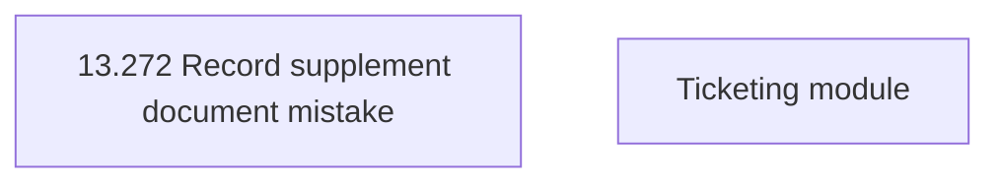

# {ADD_CLM236}Changes in use case model

```mermaid
graph TD
    n_13_272_Record_supplement_document_mistake["13.272 Record supplement document mistake"]
    Ticketing_module["Ticketing module"]
```
