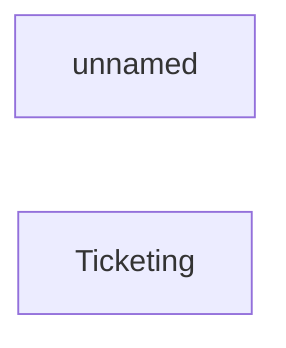

# {ADD_CLM237}Changes in use case model

- **Diagram Type**: Use Case
- **Package**: HomerSelect/BSL/Modules/Ticketing (TCK)/Requirements/CBL-33_Ticketing separation/REQ#7 - Integration with BSL- Communication/Changes in use case model
- **Diagram ID**: 156320
- **Elements**: 2
- **Connectors**: 0

