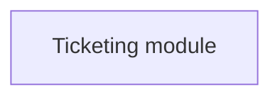

# {MOD_CLM312}Changes in use case model

- **Diagram Type**: Use Case
- **Package**: HomerSelect/BSL/Modules/Ticketing (TCK)/Requirements/CBL-33_Ticketing separation/REQ#8 - Contract registration/Changes in use case model
- **Diagram ID**: 156321
- **Elements**: 1
- **Connectors**: 0

