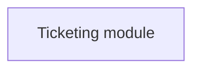

# {MOD_CLM314}Changes in use case model

- **Diagram Type**: Use Case
- **Package**: HomerSelect/BSL/Modules/Ticketing (TCK)/Requirements/CBL-33_Ticketing separation/REQ#9 - Contract search/Changes in use case model
- **Diagram ID**: 156322
- **Elements**: 1
- **Connectors**: 0

