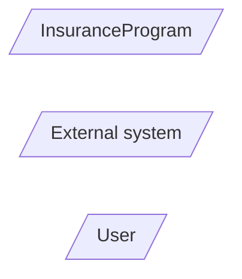

# Actors

- **Diagram Type**: Use Case
- **Package**: HomerSelect/BSL/Modules/Value Added Services (VAS)/Analytical Model/Actors
- **Diagram ID**: 154986
- **Elements**: 3
- **Connectors**: 0

```mermaid
graph LR
    InsuranceProgram[/"InsuranceProgram"/]
    External_system[/"External system"/]
    User[/"User"/]
```
