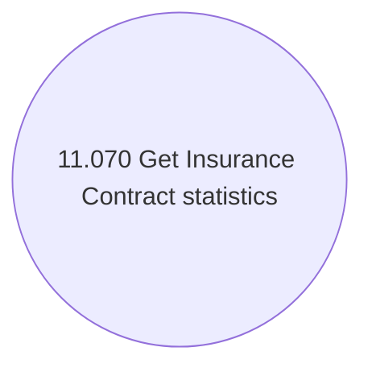

# Getting Insurance Contract statistics

- **Diagram Type**: Use Case
- **Package**: HomerSelect/BSL/Modules/Value Added Services (VAS)/Analytical Model/Insurance Contract statistics/Use Case Model
- **Diagram ID**: 142938
- **Elements**: 1
- **Connectors**: 0

