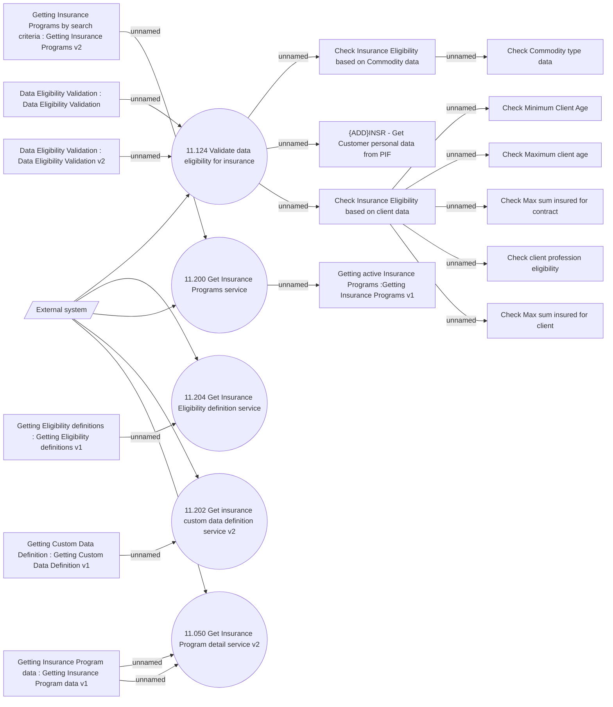

# Insurance Program functions

- **Diagram Type**: Use Case
- **Package**: HomerSelect/BSL/Modules/Value Added Services (VAS)/Analytical Model/Insurance Program/Insurance Program functionalities/Use Case Model
- **Diagram ID**: 146573
- **Elements**: 23
- **Connectors**: 22

