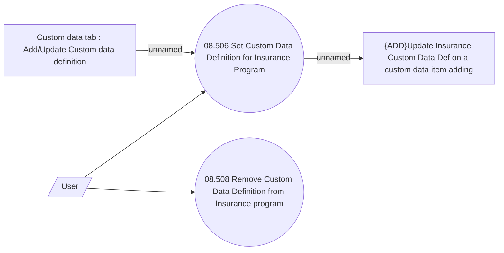

# IP - Custom Data - Use Case Model

- **Diagram Type**: Use Case
- **Package**: HomerSelect/BSL/Modules/Value Added Services (VAS)/Analytical Model/Insurance Program/Insurance Program management/Use Case Model/Custom Data
- **Diagram ID**: 141039
- **Elements**: 5
- **Connectors**: 4

