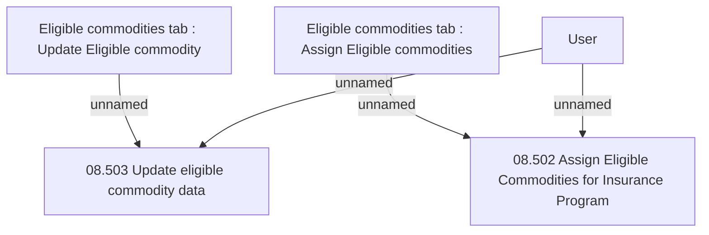

# IP - Eligible Commodities - Use Case Model

```mermaid
graph TD
    Eligible_commodities_tab_Update_Eligible_commodity["Eligible commodities tab : Update Eligible commodity"]
    Eligible_commodities_tab_Assign_Eligible_commodities["Eligible commodities tab : Assign Eligible commodities"]
    User["User"]
    n_08_503_Update_eligible_commodity_data["08.503 Update eligible commodity data"]
    n_08_502_Assign_Eligible_Commodities_for_Insurance_Program["08.502 Assign Eligible Commodities for Insurance Program"]
    Eligible_commodities_tab_Assign_Eligible_commodities -->|unnamed| n_08_502_Assign_Eligible_Commodities_for_Insurance_Program
    Eligible_commodities_tab_Update_Eligible_commodity -->|unnamed| n_08_503_Update_eligible_commodity_data
    User -->|unnamed| n_08_502_Assign_Eligible_Commodities_for_Insurance_Program
    User -->|unnamed| n_08_503_Update_eligible_commodity_data
```
