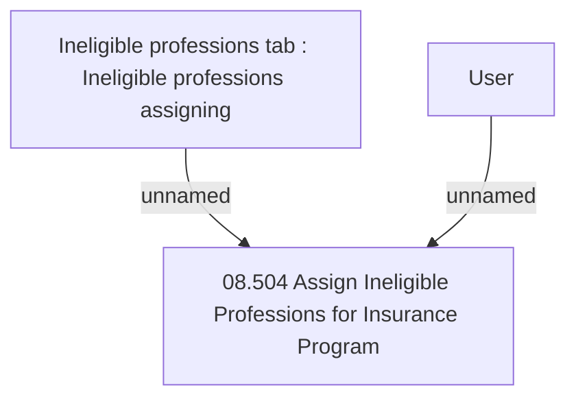

#  IP - Ineligible Professions - Use Case Model

```mermaid
graph TD
    Ineligible_professions_tab_Ineligible_professions_assigning["Ineligible professions tab : Ineligible professions assigning"]
    User["User"]
    n_08_504_Assign_Ineligible_Professions_for_Insurance_Program["08.504 Assign Ineligible Professions for Insurance Program"]
    Ineligible_professions_tab_Ineligible_professions_assigning -->|unnamed| n_08_504_Assign_Ineligible_Professions_for_Insurance_Program
    User -->|unnamed| n_08_504_Assign_Ineligible_Professions_for_Insurance_Program
```
