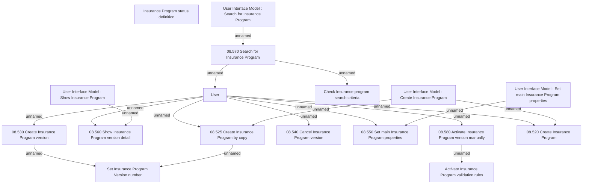

# Insurance Program management - Use Case Model

```mermaid
graph TD
    Set_Insurance_Program_Version_number["Set Insurance Program Version number"]
    Insurance_Program_status_definition["Insurance Program status definition"]
    User_Interface_Model_Set_main_Insurance_Program_properties["User Interface Model : Set main Insurance Program properties"]
    User_Interface_Model_Search_for_Insurance_Program["User Interface Model : Search for Insurance Program"]
    User_Interface_Model_Show_Insurance_Program["User Interface Model : Show Insurance Program"]
    Activate_Insurance_Program_validation_rules["Activate Insurance Program validation rules"]
    Check_Insurance_program_search_criteria["Check Insurance program search criteria"]
    n_08_580_Activate_Insurance_Program_version_manually["08.580 Activate Insurance Program version manually"]
    n_08_570_Search_for_Insurance_Program["08.570 Search for Insurance Program"]
    n_08_560_Show_Insurance_Program_version_detail["08.560 Show Insurance Program version detail"]
    n_08_530_Create_Insurance_Program_version["08.530 Create Insurance Program version"]
    n_08_540_Cancel_Insurance_Program_version["08.540 Cancel Insurance Program version"]
    n_08_550_Set_main_Insurance_Program_properties["08.550 Set main Insurance Program properties"]
    User_Interface_Model_Create_Insurance_Program["User Interface Model : Create Insurance Program"]
    User["User"]
    n_08_525_Create_Insurance_Program_by_copy["08.525 Create Insurance Program by copy"]
    n_08_520_Create_Insurance_Program["08.520 Create Insurance Program"]
    n_08_570_Search_for_Insurance_Program -->|unnamed| Check_Insurance_program_search_criteria
    User_Interface_Model_Search_for_Insurance_Program -->|unnamed| n_08_570_Search_for_Insurance_Program
    User_Interface_Model_Show_Insurance_Program -->|unnamed| n_08_560_Show_Insurance_Program_version_detail
    n_08_580_Activate_Insurance_Program_version_manually -->|unnamed| Activate_Insurance_Program_validation_rules
    User_Interface_Model_Set_main_Insurance_Program_properties -->|unnamed| n_08_550_Set_main_Insurance_Program_properties
    n_08_525_Create_Insurance_Program_by_copy -->|unnamed| Set_Insurance_Program_Version_number
    n_08_570_Search_for_Insurance_Program -->|unnamed| User
    User_Interface_Model_Create_Insurance_Program -->|unnamed| n_08_525_Create_Insurance_Program_by_copy
    User_Interface_Model_Create_Insurance_Program -->|unnamed| n_08_520_Create_Insurance_Program
    n_08_530_Create_Insurance_Program_version -->|unnamed| Set_Insurance_Program_Version_number
    User -->|unnamed| n_08_520_Create_Insurance_Program
    User -->|unnamed| n_08_540_Cancel_Insurance_Program_version
    User -->|unnamed| n_08_560_Show_Insurance_Program_version_detail
    User -->|unnamed| n_08_550_Set_main_Insurance_Program_properties
    User -->|unnamed| n_08_525_Create_Insurance_Program_by_copy
    User -->|unnamed| n_08_580_Activate_Insurance_Program_version_manually
    User -->|unnamed| n_08_530_Create_Insurance_Program_version
```
