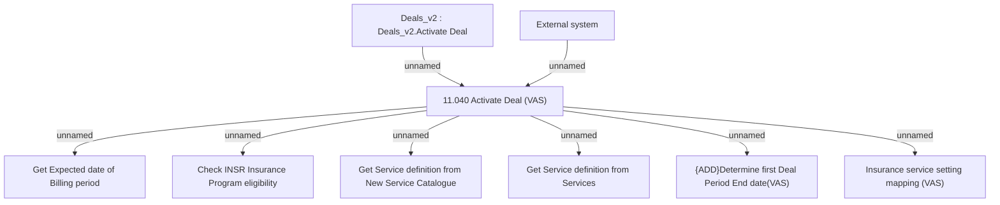

# Activate Deal - Use Case Model

```mermaid
graph TD
    Insurance_service_setting_mapping_VAS["Insurance service setting mapping (VAS)"]
    Deals_v2_Deals_v2_Activate_Deal["Deals_v2 : Deals_v2.Activate Deal"]
    ADD_Determine_first_Deal_Period_End_date_VAS["{ADD}Determine first Deal Period End date(VAS)"]
    n_11_040_Activate_Deal_VAS["11.040 Activate Deal (VAS)"]
    External_system["External system"]
    Get_Service_definition_from_Services["Get Service definition from Services"]
    Get_Service_definition_from_New_Service_Catalogue["Get Service definition from New Service Catalogue"]
    Check_INSR_Insurance_Program_eligibility["Check INSR Insurance Program eligibility"]
    Get_Expected_date_of_Billing_period["Get Expected date of Billing period"]
    n_11_040_Activate_Deal_VAS -->|unnamed| Get_Expected_date_of_Billing_period
    n_11_040_Activate_Deal_VAS -->|unnamed| Check_INSR_Insurance_Program_eligibility
    n_11_040_Activate_Deal_VAS -->|unnamed| Get_Service_definition_from_New_Service_Catalogue
    n_11_040_Activate_Deal_VAS -->|unnamed| Get_Service_definition_from_Services
    Deals_v2_Deals_v2_Activate_Deal -->|unnamed| n_11_040_Activate_Deal_VAS
    External_system -->|unnamed| n_11_040_Activate_Deal_VAS
    n_11_040_Activate_Deal_VAS -->|unnamed| ADD_Determine_first_Deal_Period_End_date_VAS
    n_11_040_Activate_Deal_VAS -->|unnamed| Insurance_service_setting_mapping_VAS
```
