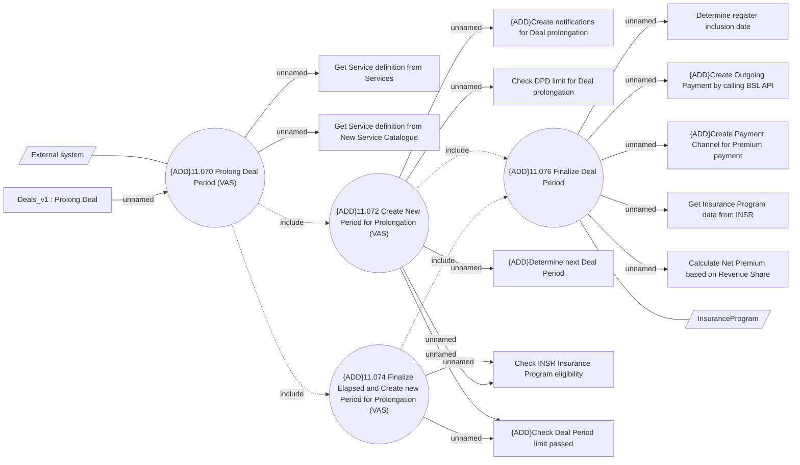

# Deal Period prolongation - Use Case Model

- **Diagram Type**: Use Case
- **Package**: HomerSelect/BSL/Modules/Value Added Services (VAS)/Analytical Model/VAS Deal/Use Case Model
- **Diagram ID**: 159285
- **Elements**: 19
- **Connectors**: 21

