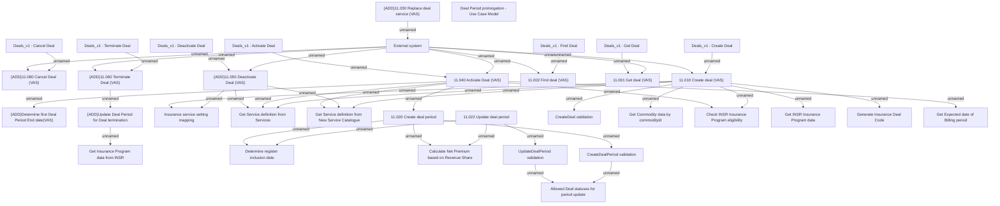

# Deal management - Use Case Model

```mermaid
graph TD
    ADD_Determine_first_Deal_Period_End_date_VAS["{ADD}Determine first Deal Period End date(VAS)"]
    ADD_11_030_Replace_deal_service_VAS["{ADD}11.030 Replace deal service (VAS)"]
    Deals_v1_Cancel_Deal["Deals_v1 : Cancel Deal"]
    ADD_11_080_Cancel_Deal_VAS["{ADD}11.080 Cancel Deal (VAS)"]
    Deal_Period_prolongation_Use_Case_Model["Deal Period prolongation - Use Case Model"]
    Get_Insurance_Program_data_from_INSR["Get Insurance Program data from INSR"]
    ADD_Update_Deal_Period_for_Deal_termination["{ADD}Update Deal Period for Deal termination"]
    Deals_v1_Terminate_Deal["Deals_v1 : Terminate Deal"]
    ADD_11_060_Terminate_Deal_VAS["{ADD}11.060 Terminate Deal (VAS)"]
    Deals_v1_Deactivate_Deal["Deals_v1 : Deactivate Deal"]
    ADD_11_050_Deactivate_Deal_VAS["{ADD}11.050 Deactivate Deal (VAS)"]
    Deals_v1_Get_Deal["Deals_v1 : Get Deal"]
    Deals_v1_Find_Deal["Deals_v1 : Find Deal"]
    Deals_v1_Create_Deal["Deals_v1 : Create Deal"]
    Deals_v1_Activate_Deal["Deals_v1 : Activate Deal"]
    n_11_040_Activate_Deal_VAS["11.040 Activate Deal (VAS)"]
    External_system["External system"]
    Determine_register_inclusion_date["Determine register inclusion date"]
    Calculate_Net_Premium_based_on_Revenue_Share["Calculate Net Premium based on Revenue Share"]
    n_11_002_Find_deal_VAS["11.002 Find deal (VAS)"]
    Insurance_service_setting_mapping["Insurance service setting mapping"]
    n_11_001_Get_deal_VAS["11.001 Get deal (VAS)"]
    Get_Service_definition_from_Services["Get Service definition from Services"]
    Get_Service_definition_from_New_Service_Catalogue["Get Service definition from New Service Catalogue"]
    Allowed_Deal_statuses_for_period_update["Allowed Deal statuses for period update"]
    n_11_022_Update_deal_period["11.022 Update deal period"]
    CreateDealPeriod_validation["CreateDealPeriod validation"]
    UpdateDealPeriod_validation["UpdateDealPeriod validation"]
    n_11_020_Create_deal_period["11.020 Create deal period"]
    CreateDeal_validation["CreateDeal validation"]
    Get_Commodity_data_by_commodityId["Get Commodity data by commodityId"]
    Check_INSR_Insurance_Program_eligibility["Check INSR Insurance Program eligibility"]
    Get_INSR_Insurance_Program_data["Get INSR Insurance Program data"]
    Generate_Insurance_Deal_Code["Generate Insurance Deal Code"]
    n_11_010_Create_deal_VAS["11.010 Create deal (VAS)"]
    Get_Expected_date_of_Billing_period["Get Expected date of Billing period"]
    Deals_v1_Activate_Deal -->|unnamed| n_11_040_Activate_Deal_VAS
    n_11_040_Activate_Deal_VAS -->|unnamed| ADD_Determine_first_Deal_Period_End_date_VAS
    n_11_010_Create_deal_VAS -->|unnamed| Insurance_service_setting_mapping
    External_system -->|unnamed| n_11_002_Find_deal_VAS
    Deals_v1_Find_Deal -->|unnamed| n_11_002_Find_deal_VAS
    n_11_020_Create_deal_period -->|unnamed| Calculate_Net_Premium_based_on_Revenue_Share
    n_11_022_Update_deal_period -->|unnamed| Calculate_Net_Premium_based_on_Revenue_Share
    n_11_020_Create_deal_period -->|unnamed| Determine_register_inclusion_date
    n_11_022_Update_deal_period -->|unnamed| Determine_register_inclusion_date
    Deals_v1_Get_Deal -->|unnamed| n_11_001_Get_deal_VAS
    External_system -->|unnamed| n_11_040_Activate_Deal_VAS
    External_system -->|unnamed| n_11_001_Get_deal_VAS
    Deals_v1_Deactivate_Deal -->|unnamed| ADD_11_050_Deactivate_Deal_VAS
    External_system -->|unnamed| ADD_11_050_Deactivate_Deal_VAS
    External_system -->|unnamed| ADD_11_060_Terminate_Deal_VAS
    Deals_v1_Terminate_Deal -->|unnamed| ADD_11_060_Terminate_Deal_VAS
    ADD_11_060_Terminate_Deal_VAS -->|unnamed| ADD_Update_Deal_Period_for_Deal_termination
    ADD_Update_Deal_Period_for_Deal_termination -->|unnamed| Get_Insurance_Program_data_from_INSR
    External_system -->|unnamed| ADD_11_080_Cancel_Deal_VAS
    Deals_v1_Cancel_Deal -->|unnamed| ADD_11_080_Cancel_Deal_VAS
    ADD_11_030_Replace_deal_service_VAS -->|unnamed| External_system
    n_11_020_Create_deal_period -->|unnamed| CreateDealPeriod_validation
    External_system -->|unnamed| n_11_010_Create_deal_VAS
    Deals_v1_Create_Deal -->|unnamed| n_11_010_Create_deal_VAS
    n_11_010_Create_deal_VAS -->|unnamed| Generate_Insurance_Deal_Code
    n_11_010_Create_deal_VAS -->|unnamed| Get_INSR_Insurance_Program_data
    n_11_040_Activate_Deal_VAS -->|unnamed| Check_INSR_Insurance_Program_eligibility
    n_11_010_Create_deal_VAS -->|unnamed| Check_INSR_Insurance_Program_eligibility
    n_11_010_Create_deal_VAS -->|unnamed| Get_Commodity_data_by_commodityId
    n_11_010_Create_deal_VAS -->|unnamed| CreateDeal_validation
    ADD_11_050_Deactivate_Deal_VAS -->|unnamed| Insurance_service_setting_mapping
    n_11_022_Update_deal_period -->|unnamed| UpdateDealPeriod_validation
    n_11_040_Activate_Deal_VAS -->|unnamed| Get_Expected_date_of_Billing_period
    UpdateDealPeriod_validation -->|unnamed| Allowed_Deal_statuses_for_period_update
    CreateDealPeriod_validation -->|unnamed| Allowed_Deal_statuses_for_period_update
    n_11_040_Activate_Deal_VAS -->|unnamed| Get_Service_definition_from_New_Service_Catalogue
    ADD_11_050_Deactivate_Deal_VAS -->|unnamed| Get_Service_definition_from_New_Service_Catalogue
    n_11_010_Create_deal_VAS -->|unnamed| Get_Service_definition_from_New_Service_Catalogue
    ADD_11_050_Deactivate_Deal_VAS -->|unnamed| Get_Service_definition_from_Services
    n_11_040_Activate_Deal_VAS -->|unnamed| Get_Service_definition_from_Services
    n_11_010_Create_deal_VAS -->|unnamed| Get_Service_definition_from_Services
    n_11_040_Activate_Deal_VAS -->|unnamed| n_11_020_Create_deal_period
```
