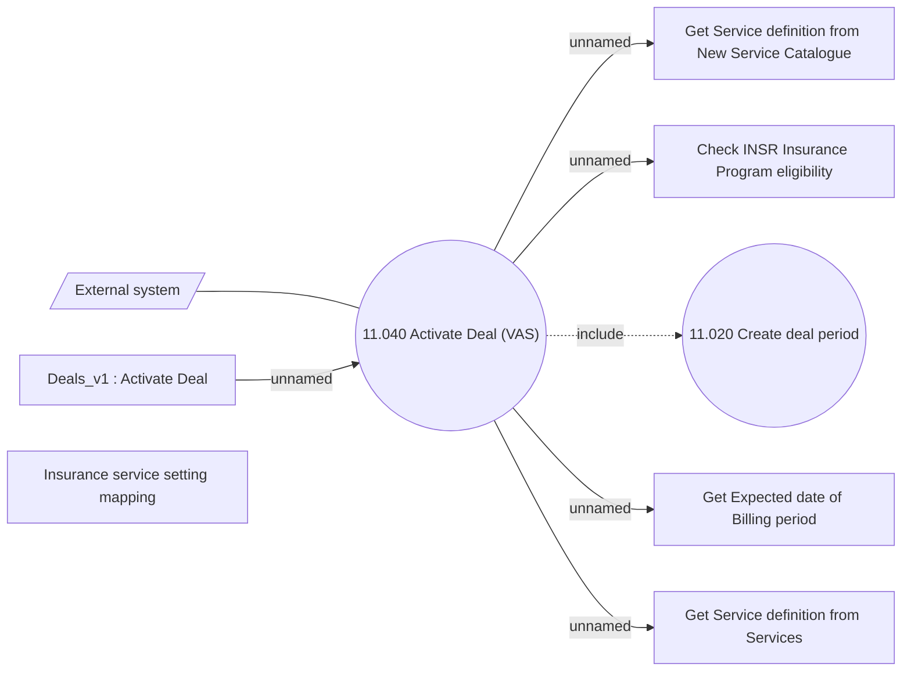

# CSI-2918 VAS Deal activation method

- **Diagram Type**: Use Case
- **Package**: HomerSelect/BSL/Modules/Value Added Services (VAS)/Requirement model/CBL-11727 (CSI-376) CSI Modularization - Insurance Contract/CSI-2918 VAS Deal activation method
- **Diagram ID**: 154450
- **Elements**: 9
- **Connectors**: 8

