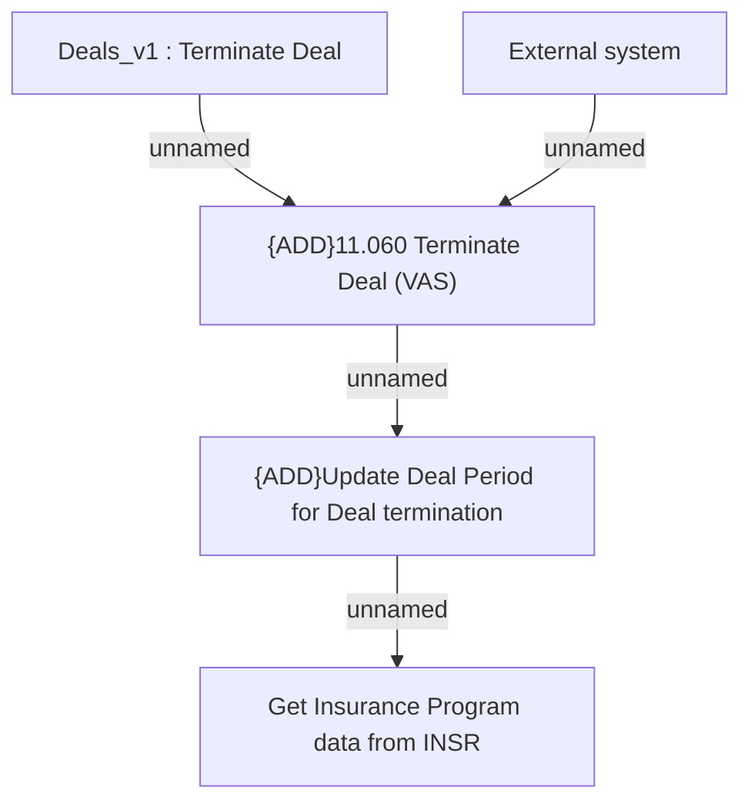

# CSI-2968 Terminate Deal method - use cases

```mermaid
graph TD
    Get_Insurance_Program_data_from_INSR["Get Insurance Program data from INSR"]
    ADD_Update_Deal_Period_for_Deal_termination["{ADD}Update Deal Period for Deal termination"]
    Deals_v1_Terminate_Deal["Deals_v1 : Terminate Deal"]
    External_system["External system"]
    ADD_11_060_Terminate_Deal_VAS["{ADD}11.060 Terminate Deal (VAS)"]
    Deals_v1_Terminate_Deal -->|unnamed| ADD_11_060_Terminate_Deal_VAS
    ADD_Update_Deal_Period_for_Deal_termination -->|unnamed| Get_Insurance_Program_data_from_INSR
    ADD_11_060_Terminate_Deal_VAS -->|unnamed| ADD_Update_Deal_Period_for_Deal_termination
    External_system -->|unnamed| ADD_11_060_Terminate_Deal_VAS
```
