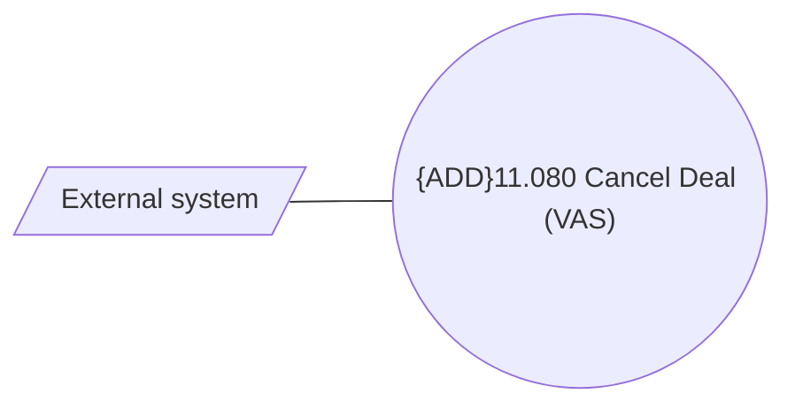

# CSI-2969 Cancel Deal method

- **Diagram Type**: Use Case
- **Package**: HomerSelect/BSL/Modules/Value Added Services (VAS)/Requirement model/CBL-11727 (CSI-376) CSI Modularization - Insurance Contract/CSI-2969 Cancel Deal method
- **Diagram ID**: 155027
- **Elements**: 2
- **Connectors**: 1

