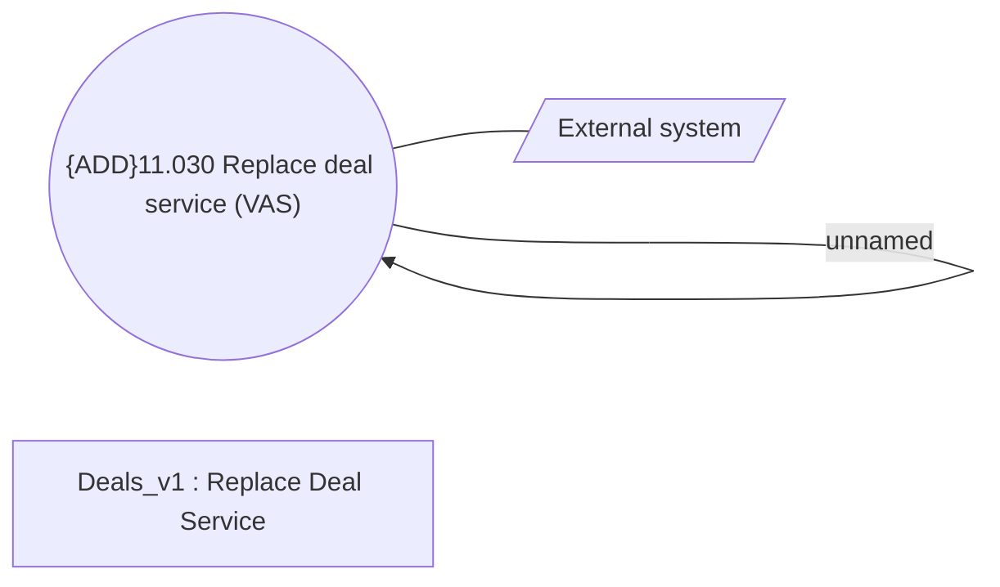

# CSI-3072 VAS - Replace Service method

- **Diagram Type**: Use Case
- **Package**: HomerSelect/BSL/Modules/Value Added Services (VAS)/Requirement model/CBL-11727 (CSI-376) CSI Modularization - Insurance Contract/CSI-3072 VAS - Replace Service method
- **Diagram ID**: 155597
- **Elements**: 4
- **Connectors**: 2

