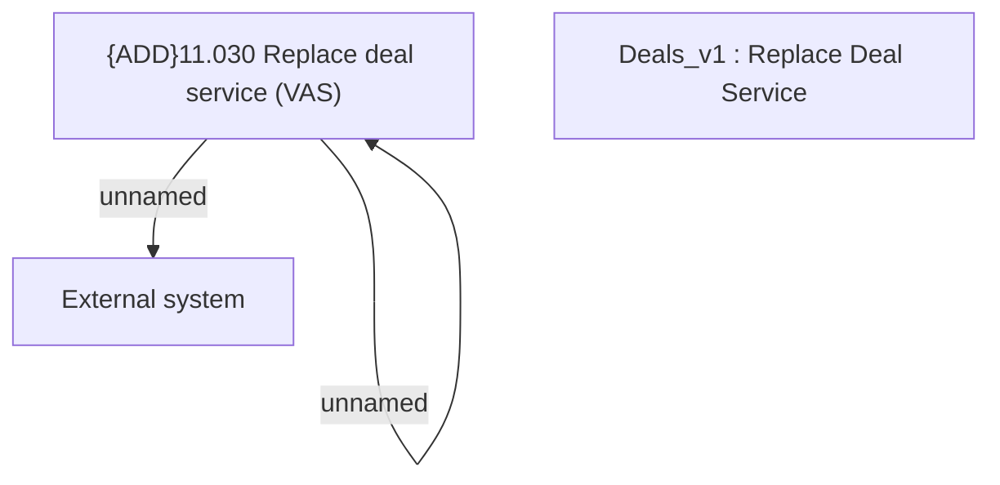

# CSI-3072 VAS - Replace Service method

```mermaid
graph TD
    ADD_11_030_Replace_deal_service_VAS["{ADD}11.030 Replace deal service (VAS)"]
    Deals_v1_Replace_Deal_Service["Deals_v1 : Replace Deal Service"]
    ADD_11_030_Replace_deal_service_VAS["{ADD}11.030 Replace deal service (VAS)"]
    External_system["External system"]
    ADD_11_030_Replace_deal_service_VAS -->|unnamed| External_system
    ADD_11_030_Replace_deal_service_VAS -->|unnamed| ADD_11_030_Replace_deal_service_VAS
```
