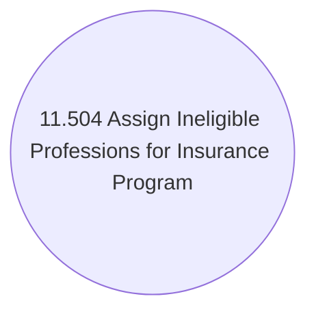

# Use case changes

- **Diagram Type**: Use Case
- **Package**: HomerSelect/BSL/Modules/Value Added Services (VAS)/Requirement model/CBL-8512 (CSI-13) CLM Modularization - Insurance Program functionalities/Use case changes
- **Diagram ID**: 124943
- **Elements**: 1
- **Connectors**: 0

