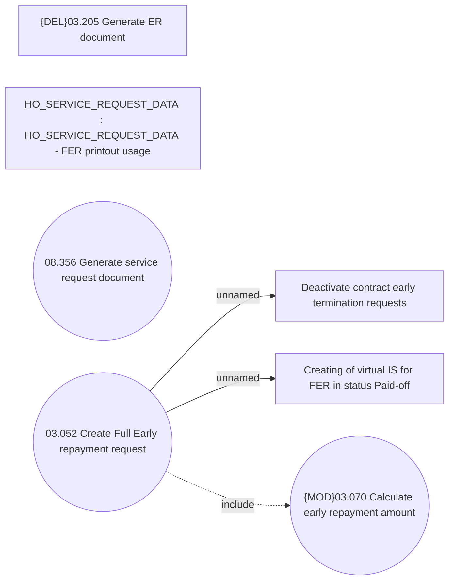

# Full early repayment - printouts

- **Diagram Type**: Use Case
- **Package**: HomerSelect/BSL/Requirements Model/Finished/CLM/CBL-1855 (CLM-956) Full early repayment services changes
- **Diagram ID**: 158895
- **Elements**: 7
- **Connectors**: 3

