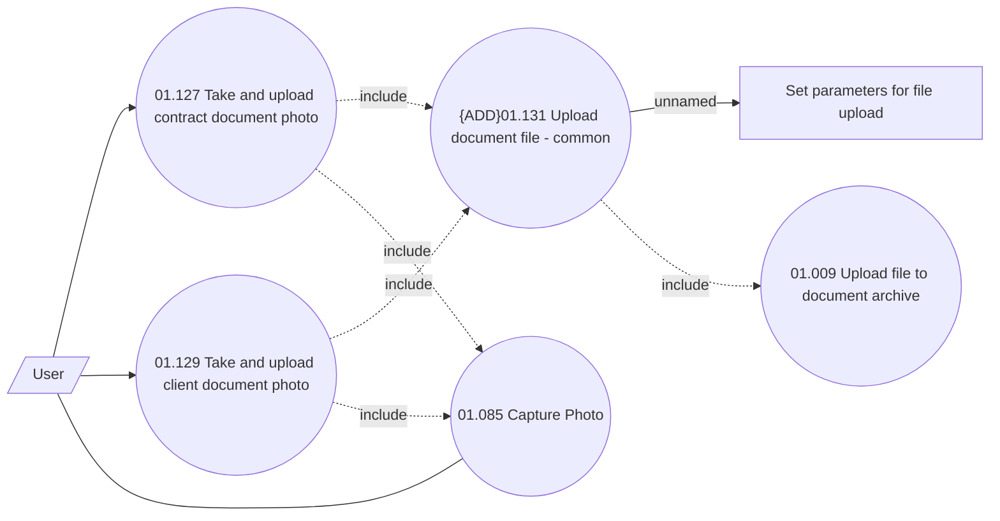

# Take document photo - use case overview

- **Diagram Type**: Use Case
- **Package**: HomerSelect/BSL/Requirements Model/Finished/CLM/CBL-3385 (CLM-1323) Add Photo component into Contract, Client Documents Tab and Ticketing Module
- **Diagram ID**: 109365
- **Elements**: 7
- **Connectors**: 9

