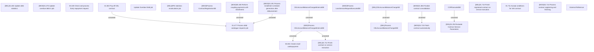

# Contract finishing after DC recalculation

```mermaid
graph TD
    DEL_01_482_Update_debt_statistics["{DEL}01.482 Update debt statistics"]
    MOD_01_475_Update_overdue_debt_in_job["{MOD}01.475 Update overdue debt in job"]
    n_01_477_Process_debt_catalogue_requests_job["01.477 Process debt catalogue requests job"]
    n_03_100_Check_and_process_Early_repayment_request["03.100 Check and process Early repayment request"]
    MOD_01_384_Finalize_contract_consolidation["{MOD}01.384 Finalize contract consolidation"]
    Update_Overdue_Debt_job["Update Overdue Debt job"]
    DEL_DPD_statistics_recalculation_job["{DEL}DPD statistics recalculation job"]
    MOD_Process_ContractRegistrationSE["{MOD}Process ContractRegistrationSE"]
    COPExecutedSE["COPExecutedSE"]
    DEL_CELAccountBalanceChangeSE["{DEL}CELAccountBalanceChangeSE"]
    CELAccountBalanceChangedInternalSE["CELAccountBalanceChangedInternalSE"]
    n_05_081_Create_small_underpayment["05.081 Create small underpayment"]
    ADD_Process_CELAccountBalanceChangedInternalSE["{ADD}Process CELAccountBalanceChangedInternalSE"]
    DEL_Process_CELAccountBalanceChangedSE["{DEL}Process CELAccountBalanceChangedSE"]
    MOD_Process_LoanServiceRequestExecutedSE["{MOD}Process LoanServiceRequestExecutedSE"]
    n_01_502_Pay_off_CEL_contract["01.502 Pay-off CEL contract"]
    MOD_05_180_Perform_coupling_payments_with_instalments["{MOD}05.180 Perform coupling payments with instalments"]
    MOD_01_191_Process_installment_schedule_generation_after_dis["{MOD}01.191 Process installment schedule generation after disbursement"]
    DEL_01_713_Finish_registered_contract_on_service_execution["{DEL}01.713 Finish registered contract on service execution"]
    n_01_711_Accept_conditions_for_SAI_contract["01.711 Accept conditions for SAI contract"]
    DEL_01_712_Finish_contract_on_service_execution["{DEL}01.712 Finish contract on service execution"]
    MOD_01_715_Finish_contract_automatically["{MOD}01.715 Finish contract automatically"]
    DEL_01_252_Evaluate_Contract_Service_Parameters["{DEL}01.252 Evaluate Contract Service Parameters"]
    MOD_01_714_Process_contract_registering_and_finishing["{MOD}01.714 Process contract registering and finishing"]
    External_Reference["External Reference"]
    External_Reference["External Reference"]
    External_Reference["External Reference"]
    n_01_502_Pay_off_CEL_contract -->|unnamed| n_01_477_Process_debt_catalogue_requests_job
    ADD_Process_CELAccountBalanceChangedInternalSE -->|unnamed| n_05_081_Create_small_underpayment
    MOD_05_180_Perform_coupling_payments_with_instalments -->|unnamed| n_01_477_Process_debt_catalogue_requests_job
    MOD_01_191_Process_installment_schedule_generation_after_dis -->|unnamed| n_01_477_Process_debt_catalogue_requests_job
    ADD_Process_CELAccountBalanceChangedInternalSE -->|unnamed| DEL_01_712_Finish_contract_on_service_execution
    COPExecutedSE -->|unnamed| DEL_01_252_Evaluate_Contract_Service_Parameters
    CELAccountBalanceChangedInternalSE -->|unnamed| ADD_Process_CELAccountBalanceChangedInternalSE
    DEL_CELAccountBalanceChangeSE -->|unnamed| DEL_Process_CELAccountBalanceChangedSE
    MOD_01_384_Finalize_contract_consolidation -->|unnamed| MOD_01_715_Finish_contract_automatically
```
