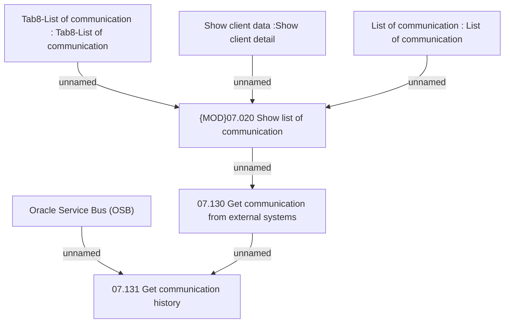

# Use case model

```mermaid
graph TD
    Oracle_Service_Bus_OSB["Oracle Service Bus (OSB)"]
    n_07_131_Get_communication_history["07.131 Get communication history"]
    Tab8_List_of_communication_Tab8_List_of_communication["Tab8-List of communication : Tab8-List of communication"]
    Show_client_data_Show_client_detail["Show client data :Show client detail"]
    List_of_communication_List_of_communication["List of communication : List of communication"]
    MOD_07_020_Show_list_of_communication["{MOD}07.020 Show list of communication"]
    n_07_130_Get_communication_from_external_systems["07.130 Get communication from external systems"]
    Oracle_Service_Bus_OSB -->|unnamed| n_07_131_Get_communication_history
    n_07_130_Get_communication_from_external_systems -->|unnamed| n_07_131_Get_communication_history
    MOD_07_020_Show_list_of_communication -->|unnamed| n_07_130_Get_communication_from_external_systems
    Tab8_List_of_communication_Tab8_List_of_communication -->|unnamed| MOD_07_020_Show_list_of_communication
    Show_client_data_Show_client_detail -->|unnamed| MOD_07_020_Show_list_of_communication
    List_of_communication_List_of_communication -->|unnamed| MOD_07_020_Show_list_of_communication
```
