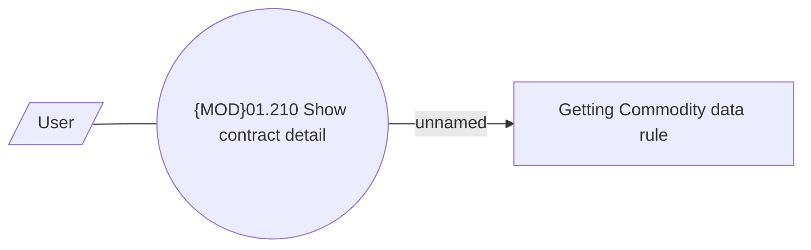

# Show Insurance commodity

- **Diagram Type**: Use Case
- **Package**: HomerSelect/BSL/Requirements Model/Finished/CLM/CLM-99 (CBL-31) Commodity Module separation
- **Diagram ID**: 98788
- **Elements**: 3
- **Connectors**: 2

