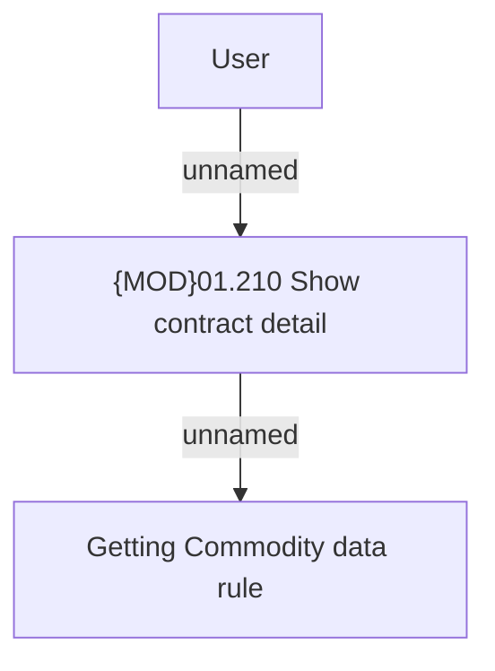

# Show Insurance commodity

```mermaid
graph TD
    Getting_Commodity_data_rule["Getting Commodity data rule"]
    MOD_01_210_Show_contract_detail["{MOD}01.210 Show contract detail"]
    User["User"]
    MOD_01_210_Show_contract_detail -->|unnamed| Getting_Commodity_data_rule
    User -->|unnamed| MOD_01_210_Show_contract_detail
```
