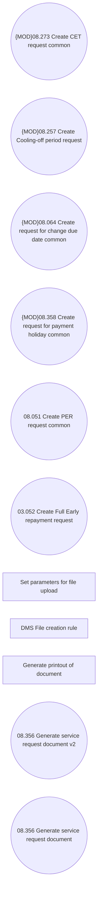

# CSI-1119 Use DMS in UC 08.356 Generate service request document

- **Diagram Type**: Use Case
- **Package**: HomerSelect/BSL/Requirements Model/Finished/CSI/CBL-12588 (CSI-545) Integrate DMS component with BSL CSI functions/CSI-1119 Use DMS in UC 08.356 Generate service request document
- **Diagram ID**: 148945
- **Elements**: 11
- **Connectors**: 0

