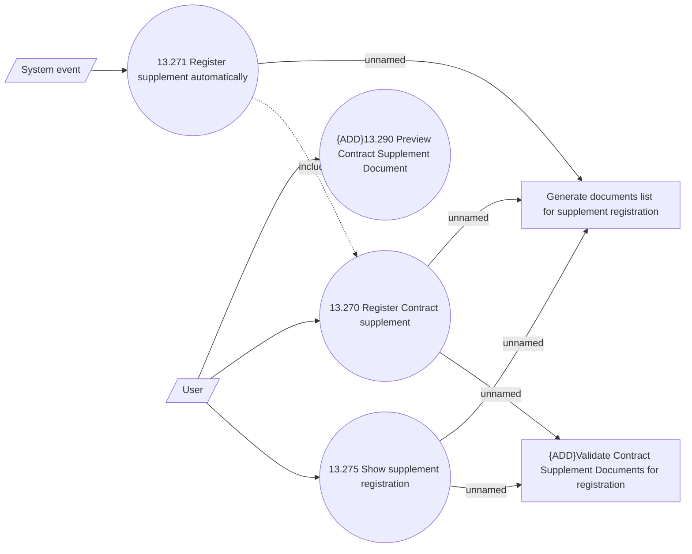

# CSI-1122 Use DMS in Contract Supplement registration functions

- **Diagram Type**: Use Case
- **Package**: HomerSelect/BSL/Requirements Model/Finished/CSI/CBL-12588 (CSI-545) Integrate DMS component with BSL CSI functions/CSI-1122 Use DMS in Contract Supplement registration functions
- **Diagram ID**: 148949
- **Elements**: 8
- **Connectors**: 10

