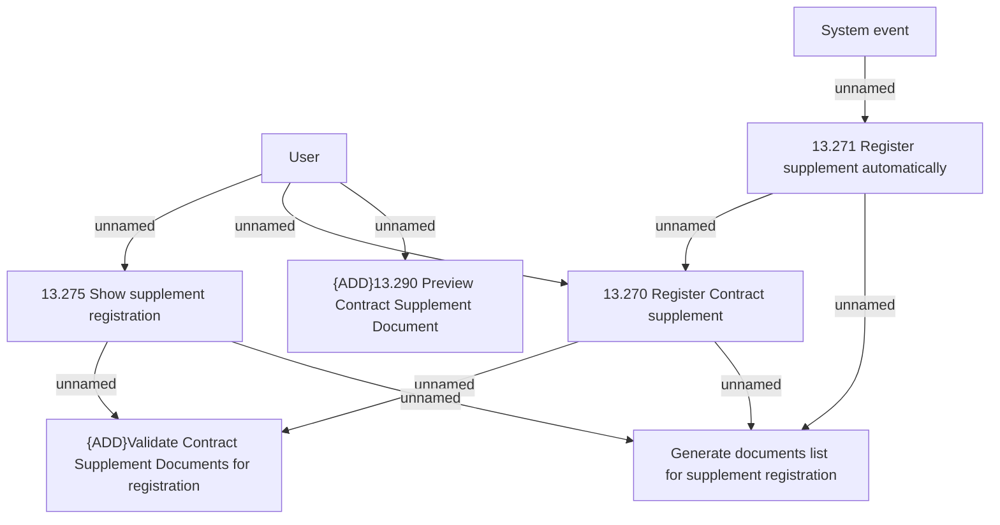

# CSI-1122 Use DMS in Contract Supplement registration functions

```mermaid
graph TD
    System_event["System event"]
    User["User"]
    n_13_275_Show_supplement_registration["13.275 Show supplement registration"]
    n_13_271_Register_supplement_automatically["13.271 Register supplement automatically"]
    Generate_documents_list_for_supplement_registration["Generate documents list for supplement registration"]
    ADD_13_290_Preview_Contract_Supplement_Document["{ADD}13.290 Preview Contract Supplement Document"]
    n_13_270_Register_Contract_supplement["13.270 Register Contract supplement"]
    ADD_Validate_Contract_Supplement_Documents_for_registration["{ADD}Validate Contract Supplement Documents for registration"]
    User -->|unnamed| n_13_275_Show_supplement_registration
    System_event -->|unnamed| n_13_271_Register_supplement_automatically
    User -->|unnamed| n_13_270_Register_Contract_supplement
    User -->|unnamed| ADD_13_290_Preview_Contract_Supplement_Document
    n_13_270_Register_Contract_supplement -->|unnamed| ADD_Validate_Contract_Supplement_Documents_for_registration
    n_13_271_Register_supplement_automatically -->|unnamed| n_13_270_Register_Contract_supplement
    n_13_270_Register_Contract_supplement -->|unnamed| Generate_documents_list_for_supplement_registration
    n_13_271_Register_supplement_automatically -->|unnamed| Generate_documents_list_for_supplement_registration
    n_13_275_Show_supplement_registration -->|unnamed| ADD_Validate_Contract_Supplement_Documents_for_registration
    n_13_275_Show_supplement_registration -->|unnamed| Generate_documents_list_for_supplement_registration
```
