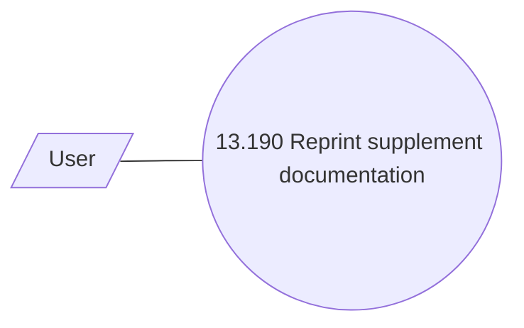

# CSI-1256 Use DMS in UC13.190 Reprint supplement documentation

- **Diagram Type**: Use Case
- **Package**: HomerSelect/BSL/Requirements Model/Finished/CSI/CBL-12588 (CSI-545) Integrate DMS component with BSL CSI functions/CSI-1256 Use DMS in UC13.190 Reprint supplement documentation
- **Diagram ID**: 148950
- **Elements**: 2
- **Connectors**: 1

