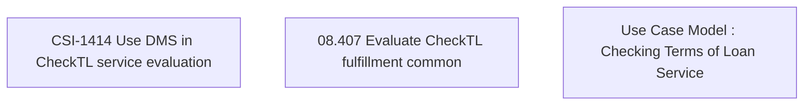

# CSI-1414 Use DMS in CheckTL service evaluation

```mermaid
graph TD
    CSI_1414_Use_DMS_in_CheckTL_service_evaluation["CSI-1414 Use DMS in CheckTL service evaluation"]
    n_08_407_Evaluate_CheckTL_fulfillment_common["08.407 Evaluate CheckTL fulfillment common"]
    Use_Case_Model_Checking_Terms_of_Loan_Service["Use Case Model : Checking Terms of Loan Service"]
```
