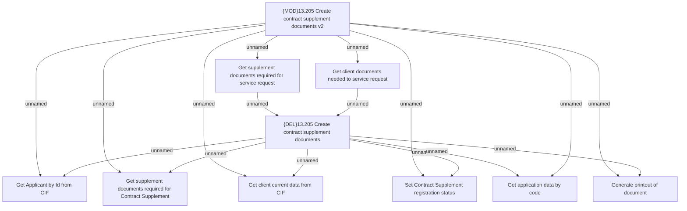

# Use DMS in 13.205 Create contract supplement documents

```mermaid
graph TD
    Get_Applicant_by_Id_from_CIF["Get Applicant by Id from CIF"]
    Get_application_data_by_code["Get application data by code"]
    Generate_printout_of_document["Generate printout of document "]
    Get_supplement_documents_required_for_Contract_Supplement["Get supplement documents required for Contract Supplement"]
    Get_supplement_documents_required_for_service_request["Get supplement documents required for service request"]
    Get_client_documents_needed_to_service_request["Get client documents needed to service request"]
    Set_Contract_Supplement_registration_status["Set Contract Supplement registration status"]
    MOD_13_205_Create_contract_supplement_documents_v2["{MOD}13.205 Create contract supplement documents v2"]
    Get_client_current_data_from_CIF["Get client current data from CIF"]
    DEL_13_205_Create_contract_supplement_documents["{DEL}13.205 Create contract supplement documents"]
    Get_supplement_documents_required_for_service_request -->|unnamed| DEL_13_205_Create_contract_supplement_documents
    Get_client_documents_needed_to_service_request -->|unnamed| DEL_13_205_Create_contract_supplement_documents
    MOD_13_205_Create_contract_supplement_documents_v2 -->|unnamed| Get_Applicant_by_Id_from_CIF
    MOD_13_205_Create_contract_supplement_documents_v2 -->|unnamed| Get_supplement_documents_required_for_Contract_Supplement
    MOD_13_205_Create_contract_supplement_documents_v2 -->|unnamed| Get_client_current_data_from_CIF
    MOD_13_205_Create_contract_supplement_documents_v2 -->|unnamed| Set_Contract_Supplement_registration_status
    DEL_13_205_Create_contract_supplement_documents -->|unnamed| Get_Applicant_by_Id_from_CIF
    DEL_13_205_Create_contract_supplement_documents -->|unnamed| Set_Contract_Supplement_registration_status
    MOD_13_205_Create_contract_supplement_documents_v2 -->|unnamed| Get_client_documents_needed_to_service_request
    DEL_13_205_Create_contract_supplement_documents -->|unnamed| Get_application_data_by_code
    MOD_13_205_Create_contract_supplement_documents_v2 -->|unnamed| Get_application_data_by_code
    MOD_13_205_Create_contract_supplement_documents_v2 -->|unnamed| Generate_printout_of_document
    DEL_13_205_Create_contract_supplement_documents -->|unnamed| Get_client_current_data_from_CIF
    DEL_13_205_Create_contract_supplement_documents -->|unnamed| Get_supplement_documents_required_for_Contract_Supplement
    DEL_13_205_Create_contract_supplement_documents -->|unnamed| Generate_printout_of_document
    MOD_13_205_Create_contract_supplement_documents_v2 -->|unnamed| Get_supplement_documents_required_for_service_request
```
