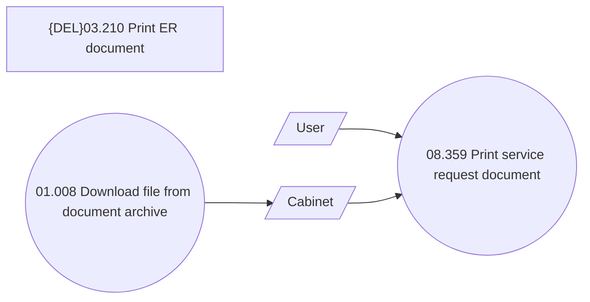

# Use DMS in UC08.359 Print service request document

- **Diagram Type**: Use Case
- **Package**: HomerSelect/BSL/Requirements Model/Finished/CSI/CBL-12588 (CSI-545) Integrate DMS component with BSL CSI functions/CSI-1120 Use DMS in UC08.359 Print service request document
- **Diagram ID**: 148946
- **Elements**: 5
- **Connectors**: 3

