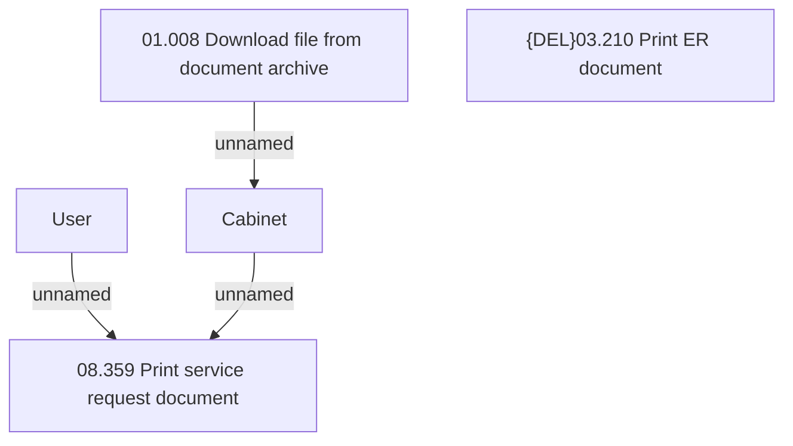

# Use DMS in UC08.359 Print service request document

```mermaid
graph TD
    Cabinet["Cabinet"]
    n_01_008_Download_file_from_document_archive["01.008 Download file from document archive"]
    User["User"]
    n_08_359_Print_service_request_document["08.359 Print service request document"]
    DEL_03_210_Print_ER_document["{DEL}03.210 Print ER document"]
    n_01_008_Download_file_from_document_archive -->|unnamed| Cabinet
    User -->|unnamed| n_08_359_Print_service_request_document
    Cabinet -->|unnamed| n_08_359_Print_service_request_document
```
