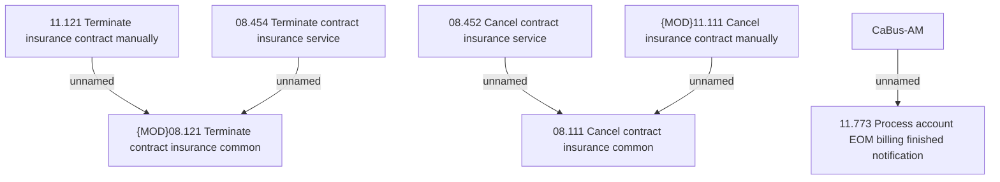

# Adding switch for ContractServiceChangeSE

```mermaid
graph TD
    n_08_454_Terminate_contract_insurance_service["08.454 Terminate contract insurance service"]
    n_11_121_Terminate_insurance_contract_manually["11.121 Terminate insurance contract manually"]
    n_08_452_Cancel_contract_insurance_service["08.452 Cancel contract insurance service"]
    MOD_11_111_Cancel_insurance_contract_manually["{MOD}11.111 Cancel insurance contract manually"]
    CaBus_AM["CaBus-AM"]
    n_11_773_Process_account_EOM_billing_finished_notification["11.773 Process account EOM billing finished notification"]
    MOD_08_121_Terminate_contract_insurance_common["{MOD}08.121 Terminate contract insurance common"]
    n_08_111_Cancel_contract_insurance_common["08.111 Cancel contract insurance common"]
    CaBus_AM -->|unnamed| n_11_773_Process_account_EOM_billing_finished_notification
    n_08_452_Cancel_contract_insurance_service -->|unnamed| n_08_111_Cancel_contract_insurance_common
    n_11_121_Terminate_insurance_contract_manually -->|unnamed| MOD_08_121_Terminate_contract_insurance_common
    MOD_11_111_Cancel_insurance_contract_manually -->|unnamed| n_08_111_Cancel_contract_insurance_common
    n_08_454_Terminate_contract_insurance_service -->|unnamed| MOD_08_121_Terminate_contract_insurance_common
```
