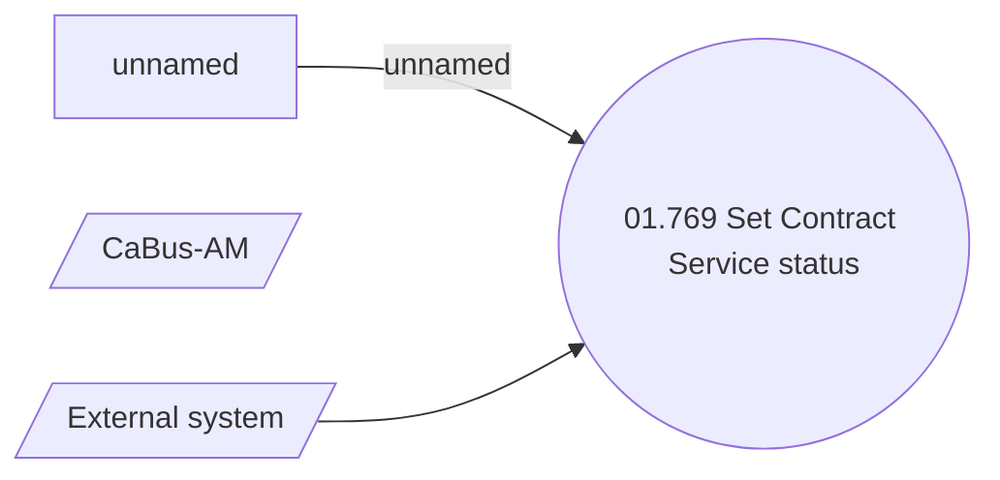

# ContractServiceActivatedNotification message variant

- **Diagram Type**: Use Case
- **Package**: HomerSelect/BSL/Requirements Model/Finished/CSI/CBL-16736 (CSI-1550) EMI Card - VAS as a service -Termination/CSI-1690 Use ContractServiceNotification message variants for notifications
- **Diagram ID**: 145019
- **Elements**: 5
- **Connectors**: 2

