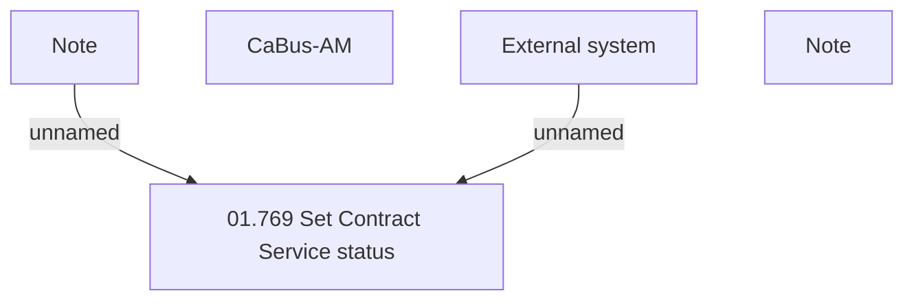

# ContractServiceActivatedNotification message variant

```mermaid
graph TD
    External_system["External system"]
    CaBus_AM["CaBus-AM"]
    el_1690707["Note"]
    n_01_769_Set_Contract_Service_status["01.769 Set Contract Service status"]
    el_1690705["Note"]
    el_1690707 -->|unnamed| n_01_769_Set_Contract_Service_status
    External_system -->|unnamed| n_01_769_Set_Contract_Service_status
```
