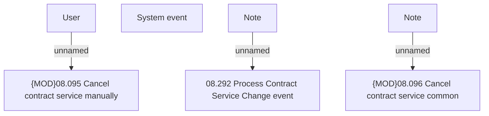

# ContractServiceCanceledNotification message variant

```mermaid
graph TD
    User["User"]
    System_event["System event"]
    el_1690708["Note"]
    el_1690709["Note"]
    MOD_08_096_Cancel_contract_service_common["{MOD}08.096 Cancel contract service common"]
    n_08_292_Process_Contract_Service_Change_event["08.292 Process Contract Service Change event"]
    MOD_08_095_Cancel_contract_service_manually["{MOD}08.095 Cancel contract service manually"]
    el_1690708 -->|unnamed| n_08_292_Process_Contract_Service_Change_event
    el_1690709 -->|unnamed| MOD_08_096_Cancel_contract_service_common
    User -->|unnamed| MOD_08_095_Cancel_contract_service_manually
```
