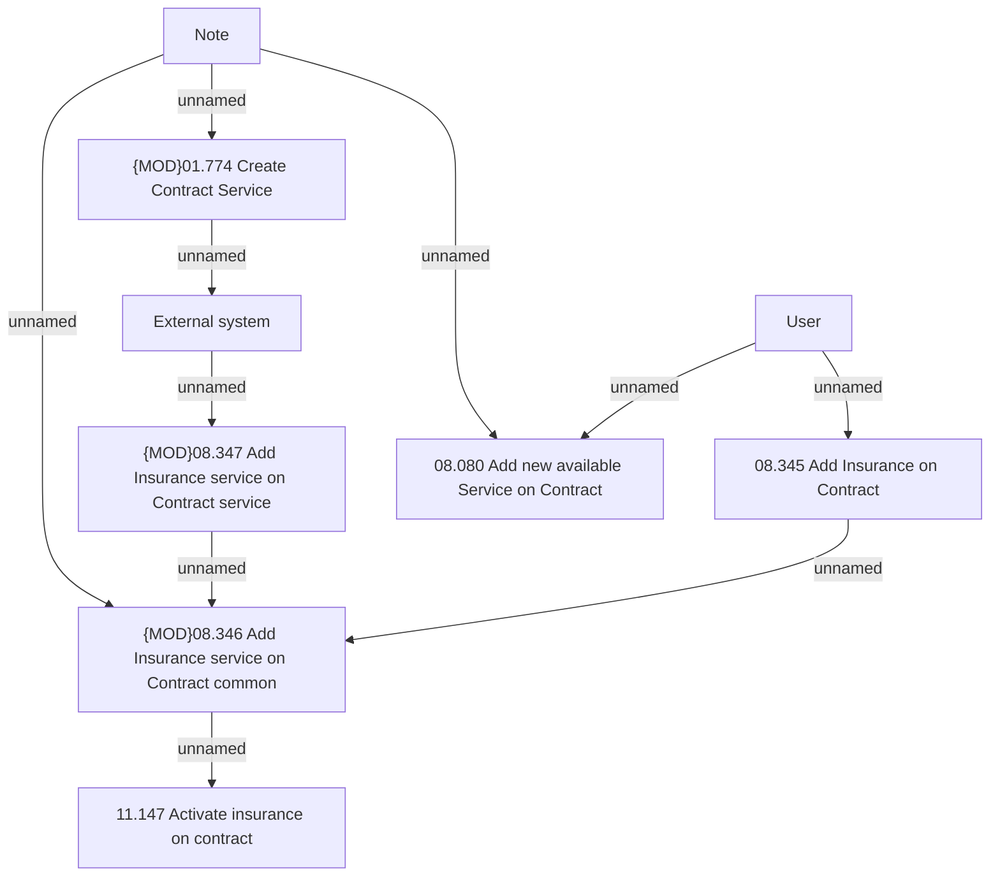

# ContractServiceCreatedNotification message variant

```mermaid
graph TD
    User["User"]
    External_system["External system"]
    MOD_01_774_Create_Contract_Service["{MOD}01.774 Create Contract Service"]
    MOD_08_346_Add_Insurance_service_on_Contract_common["{MOD}08.346 Add Insurance service on Contract common"]
    MOD_08_347_Add_Insurance_service_on_Contract_service["{MOD}08.347 Add Insurance service on Contract service"]
    n_08_345_Add_Insurance_on_Contract["08.345 Add Insurance on Contract"]
    el_1690706["Note"]
    n_08_080_Add_new_available_Service_on_Contract["08.080 Add new available Service on Contract"]
    n_11_147_Activate_insurance_on_contract["11.147 Activate insurance on contract"]
    el_1690706 -->|unnamed| MOD_01_774_Create_Contract_Service
    el_1690706 -->|unnamed| MOD_08_346_Add_Insurance_service_on_Contract_common
    el_1690706 -->|unnamed| n_08_080_Add_new_available_Service_on_Contract
    MOD_01_774_Create_Contract_Service -->|unnamed| External_system
    External_system -->|unnamed| MOD_08_347_Add_Insurance_service_on_Contract_service
    User -->|unnamed| n_08_345_Add_Insurance_on_Contract
    MOD_08_347_Add_Insurance_service_on_Contract_service -->|unnamed| MOD_08_346_Add_Insurance_service_on_Contract_common
    n_08_345_Add_Insurance_on_Contract -->|unnamed| MOD_08_346_Add_Insurance_service_on_Contract_common
    MOD_08_346_Add_Insurance_service_on_Contract_common -->|unnamed| n_11_147_Activate_insurance_on_contract
    User -->|unnamed| n_08_080_Add_new_available_Service_on_Contract
```
