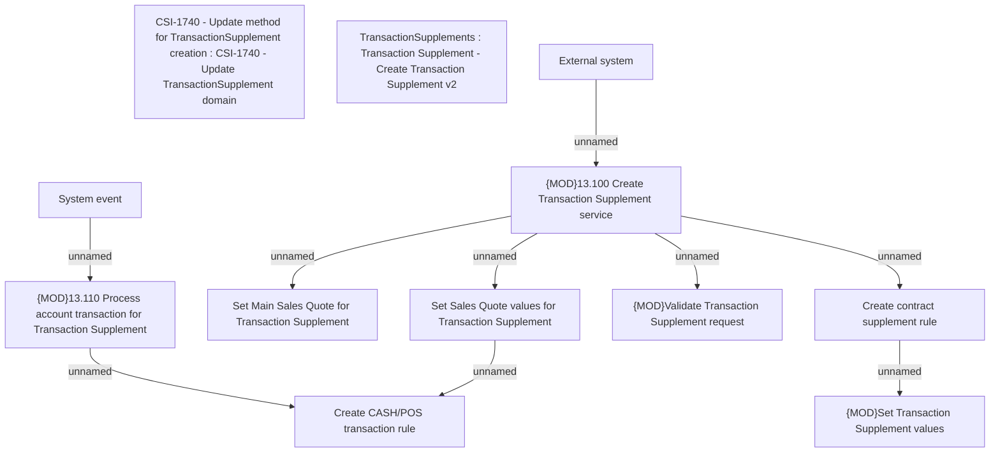

# CSI-1740 - Update method for TransactionSupplement creation

```mermaid
graph TD
    Set_Main_Sales_Quote_for_Transaction_Supplement["Set Main Sales Quote for Transaction Supplement"]
    System_event["System event"]
    MOD_13_110_Process_account_transaction_for_Transaction_Suppl["{MOD}13.110 Process account transaction for Transaction Supplement"]
    CSI_1740_Update_method_for_TransactionSupplement_creation_CS["CSI-1740 - Update method for TransactionSupplement creation : CSI-1740 - Update TransactionSupplement domain"]
    Create_CASH_POS_transaction_rule["Create CASH/POS transaction rule"]
    MOD_Validate_Transaction_Supplement_request["{MOD}Validate Transaction Supplement request"]
    Set_Sales_Quote_values_for_Transaction_Supplement["Set Sales Quote values for Transaction Supplement"]
    MOD_Set_Transaction_Supplement_values["{MOD}Set Transaction Supplement values"]
    TransactionSupplements_Transaction_Supplement_Create_Transac["TransactionSupplements : Transaction Supplement - Create Transaction Supplement v2"]
    External_system["External system"]
    MOD_13_100_Create_Transaction_Supplement_service["{MOD}13.100 Create Transaction Supplement service"]
    Create_contract_supplement_rule["Create contract supplement rule"]
    MOD_13_110_Process_account_transaction_for_Transaction_Suppl -->|unnamed| Create_CASH_POS_transaction_rule
    MOD_13_100_Create_Transaction_Supplement_service -->|unnamed| Set_Main_Sales_Quote_for_Transaction_Supplement
    MOD_13_100_Create_Transaction_Supplement_service -->|unnamed| Set_Sales_Quote_values_for_Transaction_Supplement
    MOD_13_100_Create_Transaction_Supplement_service -->|unnamed| MOD_Validate_Transaction_Supplement_request
    External_system -->|unnamed| MOD_13_100_Create_Transaction_Supplement_service
    System_event -->|unnamed| MOD_13_110_Process_account_transaction_for_Transaction_Suppl
    Set_Sales_Quote_values_for_Transaction_Supplement -->|unnamed| Create_CASH_POS_transaction_rule
    MOD_13_100_Create_Transaction_Supplement_service -->|unnamed| Create_contract_supplement_rule
    Create_contract_supplement_rule -->|unnamed| MOD_Set_Transaction_Supplement_values
```
