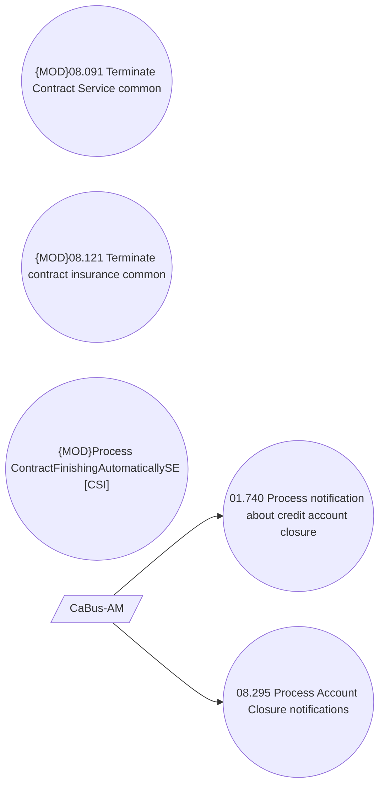

# CSI-2226 Terminate LoanService on Account Closure notification

- **Diagram Type**: Use Case
- **Package**: HomerSelect/BSL/Requirements Model/Finished/CSI/CBL-18500 (CSI-2052) Change flag SERVICE_SWITCH_ALLOWED for ACCSTMT service type/CSI-2226 Terminate LoanService on Account Closure notification
- **Diagram ID**: 149511
- **Elements**: 6
- **Connectors**: 2

