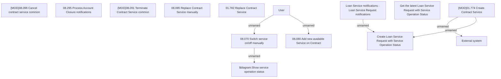

# CSI-2287 Replace LoanServiceRequest sending for Operation Status change

```mermaid
graph TD
    MOD_08_096_Cancel_contract_service_common["{MOD}08.096 Cancel contract service common"]
    n_08_295_Process_Account_Closure_notifications["08.295 Process Account Closure notifications"]
    MOD_08_091_Terminate_Contract_Service_common["{MOD}08.091 Terminate Contract Service common"]
    n_08_085_Replace_Contract_Service_manually["08.085 Replace Contract Service manually"]
    n_08_080_Add_new_available_Service_on_Contract["08.080 Add new available Service on Contract"]
    n_01_782_Replace_Contract_Service["01.782 Replace Contract Service"]
    External_system["External system"]
    MOD_01_774_Create_Contract_Service["{MOD}01.774 Create Contract Service"]
    Loan_Service_notifications_Loan_Service_Request_notification["Loan Service notifications : Loan Service Request notifications"]
    Get_the_latest_Loan_Service_Request_with_Service_Operation_S["Get the latest Loan Service Request with Service Operation Status"]
    diagram_Show_service_operation_status["$diagram:Show service operation status"]
    User["User"]
    Create_Loan_Service_Request_with_Service_Operation_Status["Create Loan Service Request with Service Operation Status"]
    n_08_070_Switch_service_on_off_manually["08.070 Switch service on/off manually"]
    MOD_01_774_Create_Contract_Service -->|unnamed| Create_Loan_Service_Request_with_Service_Operation_Status
    MOD_01_774_Create_Contract_Service -->|unnamed| External_system
    User -->|unnamed| n_08_080_Add_new_available_Service_on_Contract
    Loan_Service_notifications_Loan_Service_Request_notification -->|unnamed| Create_Loan_Service_Request_with_Service_Operation_Status
    n_08_070_Switch_service_on_off_manually -->|unnamed| diagram_Show_service_operation_status
    User -->|unnamed| n_08_070_Switch_service_on_off_manually
```
