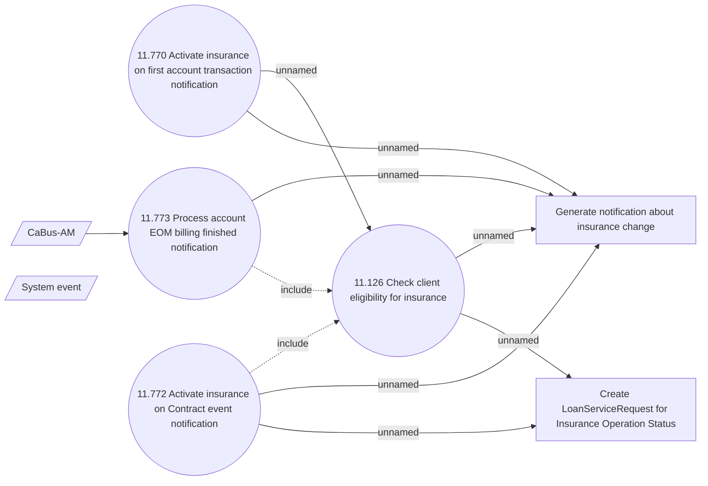

# CSI-2292 Change of Insurance Operation Status behaviour - 2

- **Diagram Type**: Use Case
- **Package**: HomerSelect/BSL/Requirements Model/Finished/CSI/CBL-18500 (CSI-2052) Change flag SERVICE_SWITCH_ALLOWED for ACCSTMT service type/CSI-2292 Change of Insurance Operation Status behaviour
- **Diagram ID**: 150350
- **Elements**: 8
- **Connectors**: 10

