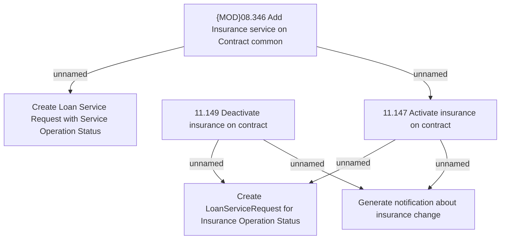

# CSI-2292 Change of Insurance Operation Status behaviour

```mermaid
graph TD
    Create_LoanServiceRequest_for_Insurance_Operation_Status["Create LoanServiceRequest for Insurance Operation Status"]
    Create_Loan_Service_Request_with_Service_Operation_Status["Create Loan Service Request with Service Operation Status"]
    MOD_08_346_Add_Insurance_service_on_Contract_common["{MOD}08.346 Add Insurance service on Contract common"]
    Generate_notification_about_insurance_change["Generate notification about insurance change"]
    n_11_149_Deactivate_insurance_on_contract["11.149 Deactivate insurance on contract"]
    n_11_147_Activate_insurance_on_contract["11.147 Activate insurance on contract"]
    MOD_08_346_Add_Insurance_service_on_Contract_common -->|unnamed| Create_Loan_Service_Request_with_Service_Operation_Status
    MOD_08_346_Add_Insurance_service_on_Contract_common -->|unnamed| n_11_147_Activate_insurance_on_contract
    n_11_149_Deactivate_insurance_on_contract -->|unnamed| Create_LoanServiceRequest_for_Insurance_Operation_Status
    n_11_147_Activate_insurance_on_contract -->|unnamed| Create_LoanServiceRequest_for_Insurance_Operation_Status
    n_11_147_Activate_insurance_on_contract -->|unnamed| Generate_notification_about_insurance_change
    n_11_149_Deactivate_insurance_on_contract -->|unnamed| Generate_notification_about_insurance_change
```
