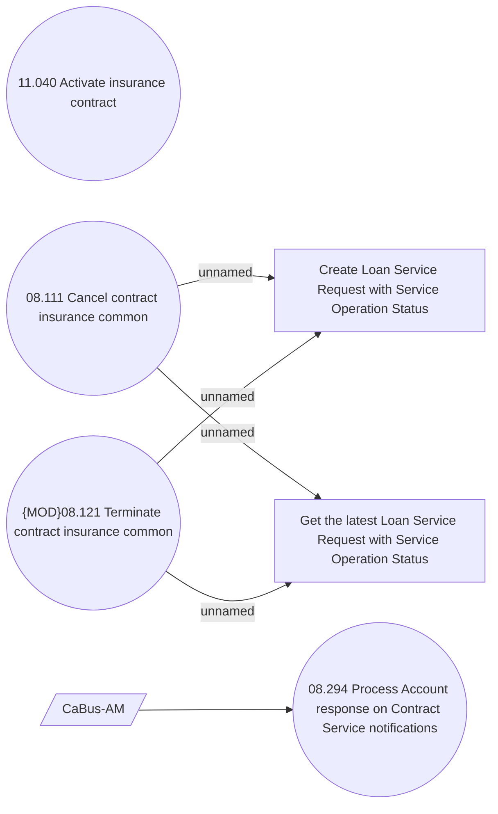

# CSI-2307 Processing AM responses on Service changes

- **Diagram Type**: Use Case
- **Package**: HomerSelect/BSL/Requirements Model/Finished/CSI/CBL-18500 (CSI-2052) Change flag SERVICE_SWITCH_ALLOWED for ACCSTMT service type/CSI-2307 Processing AM responses on Service changes
- **Diagram ID**: 151087
- **Elements**: 7
- **Connectors**: 5

