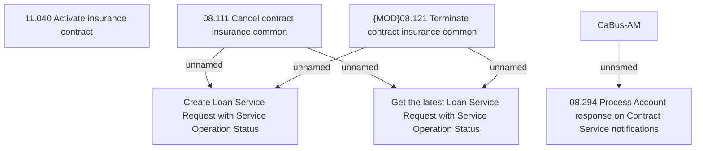

# CSI-2307 Processing AM responses on Service changes

```mermaid
graph TD
    n_11_040_Activate_insurance_contract["11.040 Activate insurance contract"]
    Get_the_latest_Loan_Service_Request_with_Service_Operation_S["Get the latest Loan Service Request with Service Operation Status"]
    Create_Loan_Service_Request_with_Service_Operation_Status["Create Loan Service Request with Service Operation Status"]
    MOD_08_121_Terminate_contract_insurance_common["{MOD}08.121 Terminate contract insurance common"]
    n_08_111_Cancel_contract_insurance_common["08.111 Cancel contract insurance common"]
    CaBus_AM["CaBus-AM"]
    n_08_294_Process_Account_response_on_Contract_Service_notifi["08.294 Process Account response on Contract Service notifications"]
    n_08_111_Cancel_contract_insurance_common -->|unnamed| Get_the_latest_Loan_Service_Request_with_Service_Operation_S
    n_08_111_Cancel_contract_insurance_common -->|unnamed| Create_Loan_Service_Request_with_Service_Operation_Status
    MOD_08_121_Terminate_contract_insurance_common -->|unnamed| Create_Loan_Service_Request_with_Service_Operation_Status
    MOD_08_121_Terminate_contract_insurance_common -->|unnamed| Get_the_latest_Loan_Service_Request_with_Service_Operation_S
    CaBus_AM -->|unnamed| n_08_294_Process_Account_response_on_Contract_Service_notifi
```
