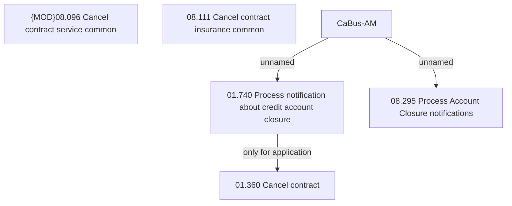

# CSI-2669 Cancel LoanService on Account Closure notification

```mermaid
graph TD
    n_01_360_Cancel_contract["01.360 Cancel contract"]
    MOD_08_096_Cancel_contract_service_common["{MOD}08.096 Cancel contract service common"]
    n_08_111_Cancel_contract_insurance_common["08.111 Cancel contract insurance common"]
    n_01_740_Process_notification_about_credit_account_closure["01.740 Process notification about credit account closure "]
    CaBus_AM["CaBus-AM"]
    n_08_295_Process_Account_Closure_notifications["08.295 Process Account Closure notifications"]
    CaBus_AM -->|unnamed| n_01_740_Process_notification_about_credit_account_closure
    n_01_740_Process_notification_about_credit_account_closure -->|only for application| n_01_360_Cancel_contract
    CaBus_AM -->|unnamed| n_08_295_Process_Account_Closure_notifications
```
