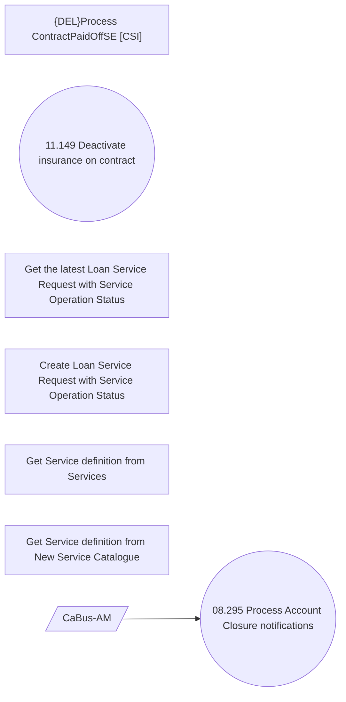

# Change LoanService status on defined Account Closure notifications

- **Diagram Type**: Use Case
- **Package**: HomerSelect/BSL/Requirements Model/Finished/CSI/CBL-18500 (CSI-2052) Change flag SERVICE_SWITCH_ALLOWED for ACCSTMT service type/CSI-2222 Change LoanService status on defined Account Closure notifications
- **Diagram ID**: 152777
- **Elements**: 8
- **Connectors**: 1

