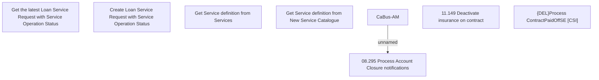

# Change LoanService status on defined Account Closure notifications

```mermaid
graph TD
    Get_the_latest_Loan_Service_Request_with_Service_Operation_S["Get the latest Loan Service Request with Service Operation Status"]
    Create_Loan_Service_Request_with_Service_Operation_Status["Create Loan Service Request with Service Operation Status"]
    Get_Service_definition_from_Services["Get Service definition from Services"]
    Get_Service_definition_from_New_Service_Catalogue["Get Service definition from New Service Catalogue"]
    CaBus_AM["CaBus-AM"]
    n_08_295_Process_Account_Closure_notifications["08.295 Process Account Closure notifications"]
    n_11_149_Deactivate_insurance_on_contract["11.149 Deactivate insurance on contract"]
    DEL_Process_ContractPaidOffSE_CSI["{DEL}Process ContractPaidOffSE [CSI]"]
    CaBus_AM -->|unnamed| n_08_295_Process_Account_Closure_notifications
```
